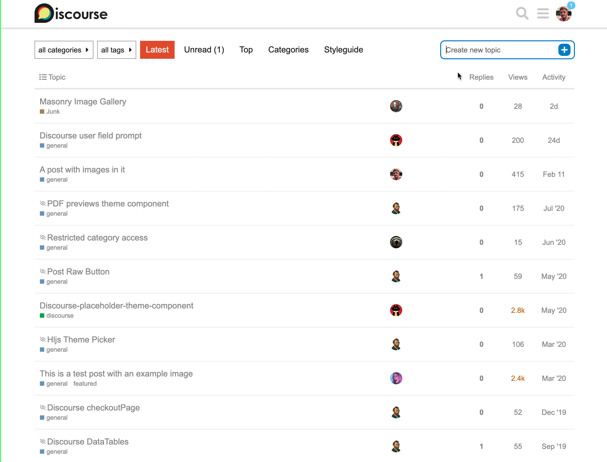

# discourse-expanded-create-topic

This component replaces the traditional `+ New Topic` button in Discourse for an input with a button. The text typed into the input will be used as the topic title once clicking `+`.

